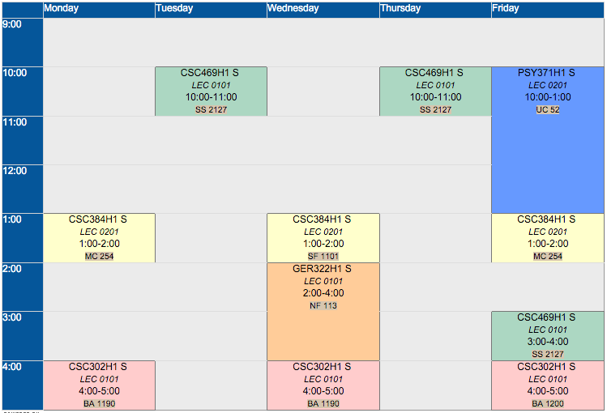
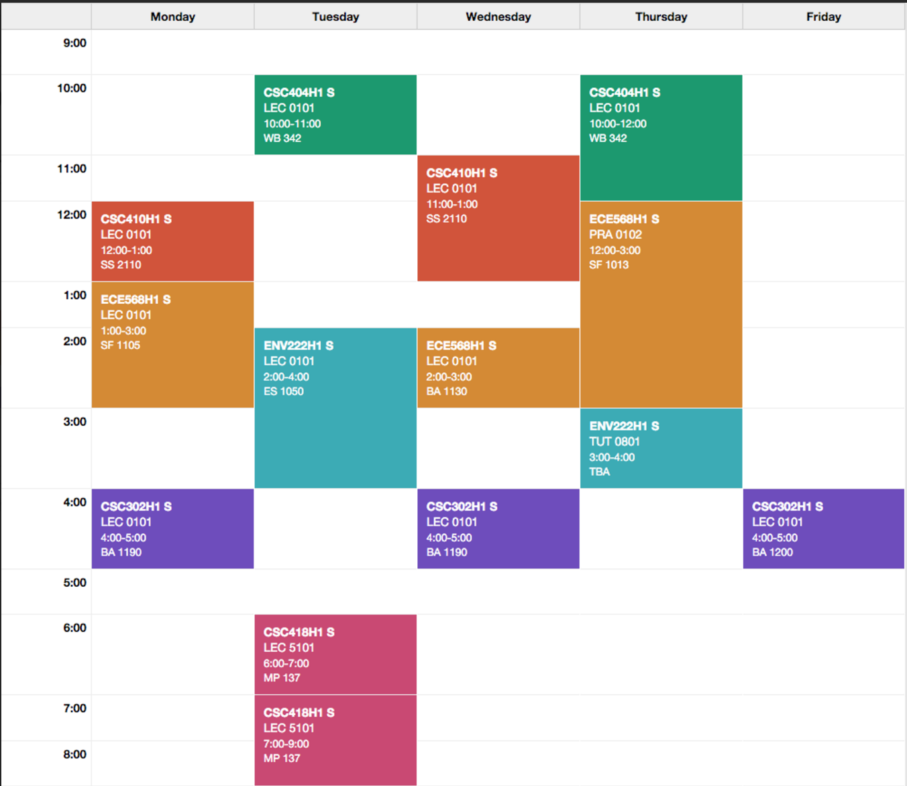

# Team Competencies 

We have a spread sheet with contact info made available on:
[https://docs.google.com/spreadsheets/d/1LfSgmDoSnULhLjMVE5bQCjYGJyJ62qTQ9iqQ8ky01Bk/edit#gid=0](https://docs.google.com/spreadsheets/d/1LfSgmDoSnULhLjMVE5bQCjYGJyJ62qTQ9iqQ8ky01Bk/edit#gid=0)

### Lev Ufimtsev

- Experience:
	- CSC309 for webdevelopment. Javascript/CSS/html/etc.. 
	- Worked at Red Hat for 16 moths
- Skills:
	- Web-languages / git / IDEs like Eclipse and Intellij / emacs / vim 
	- hacking stuff in general
- Availability
 - I live on campus, available non-lecture time and weekends:

### Abay Jashibekov

- Experience:
	- Worked in an IT security company (customized an AngularJS/JS/... app for the company)
- Skills:
	- С/Java, JS/HTML/..., git, Eclipse IDE
- Availability
 - I live on campus, available almost always (except for Mon, Tue, Wed, Fri evenings)

### Hin Shun Edgar Lee

- Experience:
	- Worked at Financeit for 12 months
- Skills:
	- Frontend / Backend web development
- Availability
 - I live on campus, available online non-lecture time and weekends:

# Meetings 

## Meeting 1 - 26th of feb
We met face-to-face in tutorial. We threw around ideas for a plugin and narrowed it down to a taggable bookmarks plugin.  

We then disscussed popential features and bonus features that we could implement, as well as a way to distribute work.  

We created this shared git group repo to keep track of code/note artifacts.

We will communicate primarily over slack, it's a chat tool that works on many platforms and has some cool integrations with tools such as git.

## Future meetings
We will probably meet online via Slack for implementation and weekly during tutorial face-to-face to catch up on everything.  
We haven't determined the exact time that we will meet up, it may be spontaneously depending on when we implement things.

