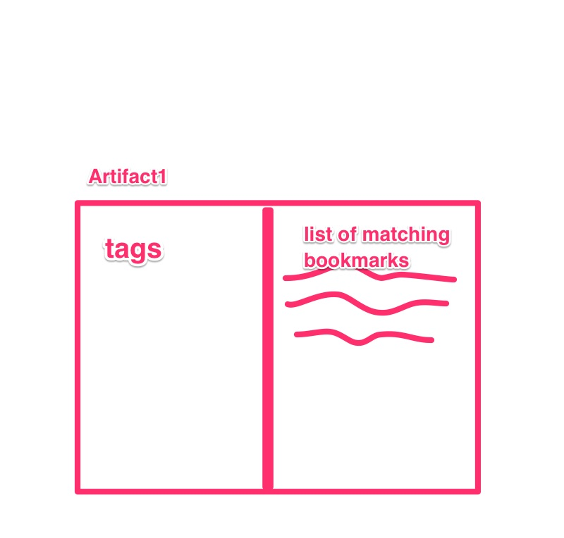
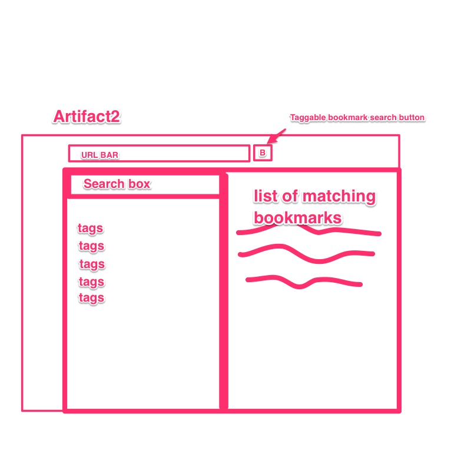

## Summary 
Implement taggable bookmarks plugin for anyone who uses bookmarks.

## What are you planning to build 
We are planning to build a Firefox plugin that will implement taggable bookmarks. 

The details are as following:

- When you bookmark a page, when you set name of the bookmark, you can add tags inline with a "__" prefix. e.g.:  

		bug 123 - my evil bug   __tag1 __tag2
- Then the plugin will have a search functionality that will list all the tags that it finds and presents them in an alphabetically sorted list. e.g.: 

		tag1
		tag2
		bike
		road
		offroad 
		
	
- Because tags are simply stored as part of a bookmark's title, the main advantage of this approach is that this plugin will work with existing bookmark sync services and will not require additional login or synchronization with yet another service. It will also be backwards compatible with older bookmarks (tags can be added to them by the user).
		
- The user will be able to select one or more tags, and the plugin on the right will present matching bookmarks. For example, the user may select "bike" and "road", and the plugin will list all the bookmarks that include the "bike" and "road" tags.

- In addition, there will be a search bar that will allow the user to further narrow down bookmarks based on a fuzzy search. I.e, he/she may search for "evil 123" and find the example above.

- When clicking on a result, the search pane will be closed and the selected bookmark will be opened.

- This should allow the user to quickly search through his/her bookmarks to narrow down a large set of bookmarks to a smaller one.

#### Bonus features 
If time permits, we may add bonus features to our plugin:

- Global shortcut to open bookmark search plane
- Sort tags by count (most popular at the top)
- Add the number of matching bookmarks next to the tag
- Allow the user to select their own prefix, e.g. "#" instead of "__"
- Search syntax to support inline typing of tags rather than selecting from a list, e.g.: 

		+tag1 bug 123
		
- Exclude tags, i.e list all bookmarks that don't match a certain tag. This is used in combination with other tags, ex:  

		+tag1 +bike -road 123

- The user may have the ability to select multiple matching bookmarks instead of just one, and all of them will be opened. 
- Button to open all matching bookmarks. The use case for example is to tag pages with "__readlater" and then find them and open all such bookmarks.
	- A bonus to the bonus would be to have a method (eg checkbox) that would open that page and remove the tag from that bookmark. Ex this would remove the '__readlater' tag from the bookmark so that it wouldn't be listed in the next search any more.

- An option to not close the search plane when opening a link. This may be handy if you want to open a bunch of bookmarks and see which one it was that you're looking for without searching again.

- **Indexer:** Instead of searching through the whole set of bookmarks every time, we could construct an indexer that will point to matching tags. This may be useful in case the static implementation turns out to be slow for large arrays of bookmarks. However, we first need to evaluate the static search implementation.
 
#### Limitations 
- Spaces in tags will be problematic. In the scope of this plugin we assume that spaces seperate tags. I.e, the user would have to underscores in place of spaces.
- It's unlikely, but some bookmarks may contain text that may be interpreted as a tag. As such, care must be taken to select the prefix for a tag. For example a single hash "#" may cause unexpected entries to be listed as tags.

## How are you planning to build it 
Tentatively, we will probably use the Firefox addonSDK to implement this functionality. However, we will investigate if it's possible to do it in webextension also. 

In terms of components:  

### UI Components

- **Browser button:** We will have a button that opens the bookmark search pane. This will be located somewhere near the bookmark button in firefox, near the URL bar.
- **Search pane:** We will have a search pane that will have a search bar, a list of tags that can be clicked on and results on the right, as depicted in Artifact 2: 
	
- **Clickable tags:** When clicking on each listed tag, it will be changed so that it is visible that it is clicked. For example, we could use a button that when pressed is held down.
- **List of Results:** The matching bookmarks will be listed on the right. When you click on one, it will close the search pane and instead open the bookmark. 

### Backend Components

- **Tag Parser:** The tag parser should be fired up when ever the user clicks on the Browser button. It will read all the bookmarks and generate the tags that it finds. It will return an array of tags. Internally we may use a hashtable for this instead of an array.
- **UI Generator:** given a list of tags, the UI generator should produce the matching UI with the search bar and list of tags. It should add event listeners to the relevant UI elements such as tags and search bar.
- **Result List:** The component that will list the results and handle the underlying logic when something is clicked.

	
### Assignment of work
We may meet up to code on stuff together, or we may assign individual features of the project to each person. e.g. bonus features etc.. 
  
