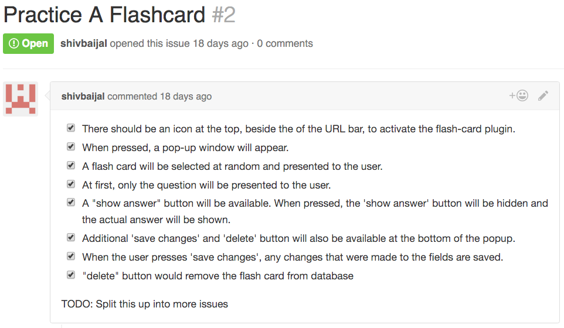
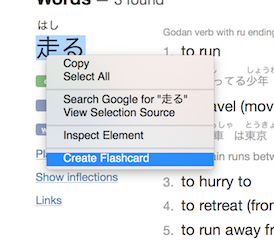
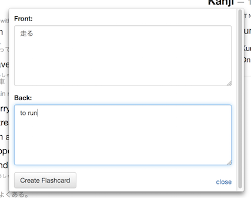
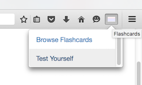
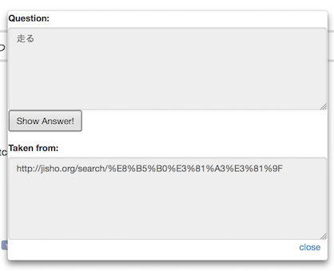
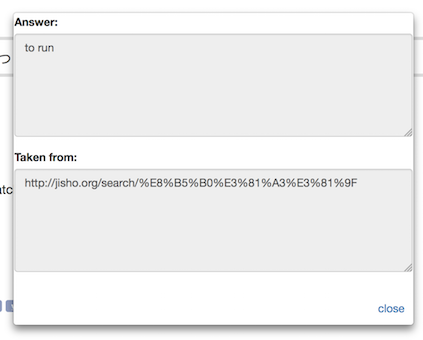
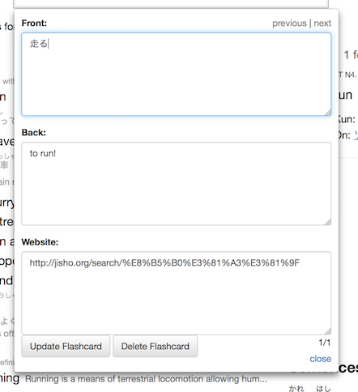
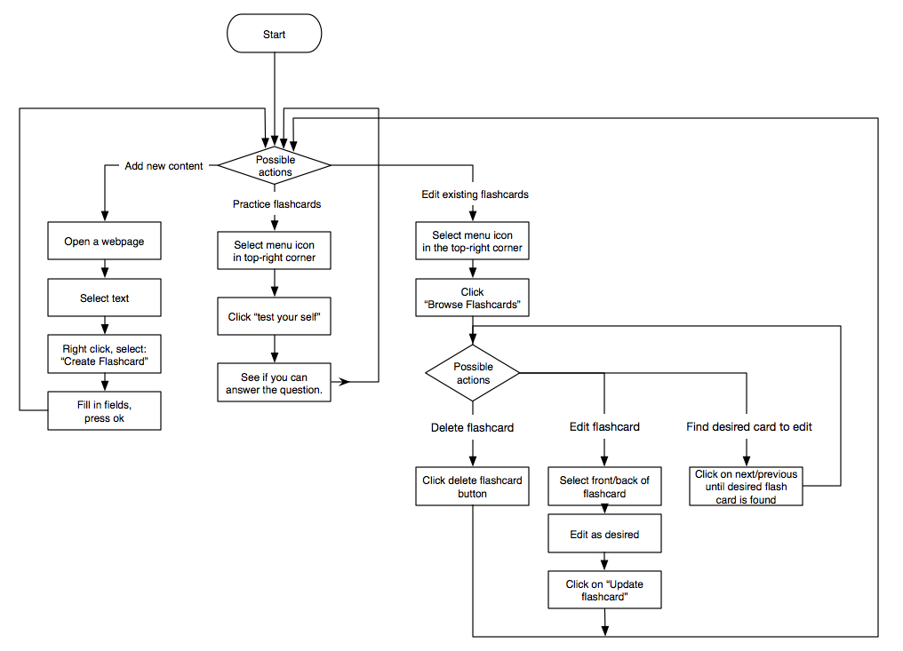

# Technical Product Report

## Summary
During phase p2, we have implemented the features as per original [feature specifications] (../../featurespec.md).  
In addition, we also implemented one of the bonus features (browsing through cards).

## Target users 
This plugin is intended for anyone who wants to memorize something that they come across on the web. This may be vocabulary if you are learning a foreign language, it may be terminal commands if you're an IT professional or it could be course material if you are a student. 

## Team organization 
### Task management 
We managed tasks via the [github issue tracker within the repository](https://github.com/csc302-2016-spring/group1/issues?utf8=%E2%9C%93&q=is%3Aissue).  
Each issue represented a task. Inside the issue, the task was sub-divided into smaller tasks via checkmarks:  

We used tasks [#2](https://github.com/csc302-2016-spring/group1/issues/2) and [#4](https://github.com/csc302-2016-spring/group1/issues/4) as guidance for implementing features.

Task assignment was done Facebook engineering style (as per continuous deployment lecture, March 28th). I.e, each team member determined what had to be done at any given point in time and got it done.

### Team meetings and communication
The first meeting for P2 was held during tutorial (when we changed from tags to flashcards). All members were present.  

The following material was disscussed during the meeting:

- We brainstormed many different ideas 
- We came up with the flashcard idea
- Then we did more brainstorming for possible features, 
  - How users would use them
  - Pros and cons of each feature
  - The 'value' of each feature, i.e what is important and what is 'nice to have'.
- We narrowed the scope of ideas to a set of core (must-have) set of features and a few bonus features. We wrote the [feature specification document] (../../featurespec.md).  
- We talked about which plugin framework we should use. We concluded to use the traditional addonSDK as it had the biggest set of features currently available. 

We primarily spoke over slack, which is a group chat application. 

Subsequent meetings after the first one were typically done at the end of a lecture, on the way out of the lecture room or over slack in the evenings.

### Reflection on teamwork 
In general, the process of picking things to do and getting it done worked rather well, because it allowed each individual to work on their preferred task when they had time to work on it. I.e, Sometimes people were too busy to come to meetings in lecture, so following up with things on slack allowed everyone to keep up. The drawback of everyone deciding what to work on them selves was that sometimes it was a little bit unclear on who was working on what.

## Product walkthrough with screenshots

You can select text, right-click, and from the context menu you can click on "create Flashcard":

You will be presented with a window. This window intends to represent the front and back of the flashcard. The front is intended to be the question, it is pre-populated with the text that you have selected, however you can edit the text to your needs. You can then fill in the back yourself, it is the intended answer.  
You then click on "Create Flashcard" to save it into the database:

At the top right of your toolbar, you can see an icon that looks like a paper index card. This is the flashcard plugin menu. When you click on it you are faced with two options, "Browse Flashcards" and "Test Yourself":

If you click on "Test Yourself", then you are presented with a random flashcard that at first only shows the front and a link to the original source url of the card:

When you click on "Show Answer!", you are presented with the answer to the original question:

If you had originally clicked on "Browse Flashcards" from the drop down menu, then you are presented with the first flashcard in the database. You can click on "next" and "previous" to navigate through the flashcards. You can edit the front and back and when you are done you click on "Update Flashcard". You can also delete the flashcard by clicking on "Delete Flashcard"

## State diagram 
The possible actions that the user can perform is illustrated by the following flow chart diagram:

## Challenges and technical highlights
In order to persist flashcards across Firefox restarts, we decided to use the add-on's simple storage which persists to the current Firefox profile. This made sense because flashcards are only relevant for the user currently logged in.

During development, we had to [disable verification of plugins](http://superuser.com/questions/956145/how-to-force-install-an-unverified-firefox-extension-in-41-0b1), as otherwise the plugin would not be loaded. The plugin could then be used in a regular firefox session via:  

	jpm run --no-copy --profile "/Users/YOUR_USER_NAME/Library/Application Support/Firefox/Profiles/YOUR_PROFILE_CODE.default"

## Plans for final demo
Initially we planned to implement the "editing of existing flashcards" (bonus feature) after good Friday. But since P2 got moved back a week, we finished up with all the planned features and are good to go.

We plan to implement:
- Other options for sequencing cards in the test panel, such as random order or spaced repetition.
- Links that let us switch easily between testing and browsing on the same card.
- Source links on the cards and a way to verify that links are well-formed when they are updated.
- A way to change which side of the card the highlighted text is pasted to.
- A 'next' link on the test panel to be able to review multiple cards successively.
